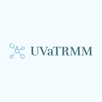

<p align="center">
    
</p>

# UVaTRMM: Distributed TRMM for commodity clusters

UVaTRMM is an open source C implementation for distributed TRMM (Triangular Matrix-Matrix Multiplication).
It leverages MPI to enable distributed memory executions.

Remark: By commodity clusters we mean small systems equipped with, at most, 40 nodes.

## Compiling UVaTRMM

```bash
$ cd UVaTRMM
$ make all
```

Dependencies: 

* MKL (or equivalent, for TRMM and GEMM kernels)
* MPI (remember to properly link the chosen library)

  
## For comparison against ScaLAPACK

We provide ScaLAPACK GEMM and TRMM sample codes ready to be compiled and compared with our implementation.

Compile them with:
```bash
$ cd ScaLAPACK
$ make
```

## For comparison against SLATE

Please download the SLATE latest version from its repository (https://github.com/icl-utk-edu/slate)

# How to cite

If you write a scientific paper describing research that makes substantive use of UVaTRMM, we would appreciate that you cite the following paper:

* On the improvement of the triangular matrix product in commodity clusters [Under review]

```BibTeX
	@Article{Carratala2023:UVaTRMM,
	author = "Santamaria-Valenzuela, Inmaculada and Carratal{\'a}-S{\'a}ez, Roc{\'i}o and Torres, Yuri and Llanos, Diego R. and Gonzalez-Escribano, Arturo",
	title="On the improvement of the triangular matrix product in commodity clusters",
	journal="The Journal of Supercomputing",
	year="To appear (submitted in Sept. 2023)",
	issn="1573-0484",
	doi="XXXX",
	}   
```
